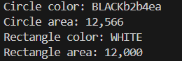

# AbstractShape Application

Este projeto em Java demonstra a aplicação de herança e polimorfismo utilizando classes abstratas e interfaces para representar diferentes formas geométricas.

## Sobre o Projeto

O programa define formas geométricas abstratas e concretas, permitindo o cálculo da área de círculos e retângulos, além de exibir suas cores. O objetivo é mostrar como utilizar conceitos de POO (Programação Orientada a Objetos) como herança e polimorfismo.

### Estrutura do Projeto

- **Pacote `model.entities`**: Contém as entidades que representam as formas geométricas:
  - `AbstractShape`: Classe abstrata que define propriedades comuns (ex.: cor).
  - `Circle`: Classe concreta que representa um círculo.
  - `Rectangle`: Classe concreta que representa um retângulo.

- **Pacote `model.enums`**: Contém a enumeração:
  - `Color`: Define as cores disponíveis (ex.: BLACK, WHITE).

- **Pacote `application`**: Contém a classe principal `App` que executa o programa.

## Funcionalidades

- Criação de formas geométricas com cor e dimensões específicas.
- Cálculo da área das formas.
- Exibição das propriedades das formas (cor e área).

### Exemplo de Saída

